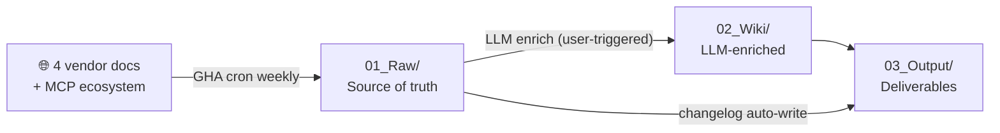

# AI Coding Runbook

[](./LICENSE)
[](https://github.com/NickCollect/ai-coding-runbook/commits/main)
[](https://github.com/NickCollect/ai-coding-runbook)
[](https://github.com/NickCollect/ai-coding-runbook/actions/workflows/refresh-raw.yml)
[](https://github.com/NickCollect/ai-coding-runbook/stargazers)

**English** | [中文](./README.md)

> **If you use Claude Code, Cursor, Codex CLI, Gemini and MCP, and you're tired of jumping across scattered official docs**, this repo gives you a **local, searchable, agent-readable multi-vendor AI coding knowledge base**. Weekly auto-sync of 4 vendors' official docs + the MCP ecosystem + LLM enrichment into a queryable wiki — clone it and your AI agent has long-term context out of the box.

---

## Why this exists

If you ——

- heavily use Claude Code / Cursor / Codex CLI but spend hours every week chasing each vendor's release notes / new features
- want cross-vendor comparisons ("Should I use Skills or MCP server? Are Cursor Rules the same as Claude's CLAUDE.md?") but each official site only covers itself
- want to give your AI agent **multi-vendor** long-term context, but no off-the-shelf open-source option exists
- find docs change so fast that model weights go stale, and your agent keeps answering with old info

then this repo auto-pulls 4 vendors' official docs (Anthropic / OpenAI / Google / Cursor) + the MCP ecosystem **weekly** + LLM-enriches them into **queryable entities / cheatsheets / decision matrices**. Clone it, open in your agent, and you have a long-term context store ready to go.

---

## Is this for you?

✅ **Yes if you're**:

- A heavy AI coding tool user (Claude Code / Cursor / Codex / Aider — any combination)
- A developer tracking docs changes across Claude / OpenAI / Gemini / Cursor
- Looking for multi-vendor long-term context for your AI agent
- A team wanting to internalize "which tool fits which job" without manually scraping docs
- An AI content creator / consultant who needs to cross-reference vendor docs

❌ **No if you want**:

- Latest model benchmarks (use lmarena / Artificial Analysis instead)
- Code samples to run (use official cookbooks / quickstart repos)
- Sub-week-fresh doc changes (this repo crons weekly)

---

## vs Alternatives

| | Official docs | awesome-* lists | Context7 / commercial services | **This repo** |
|---|:---:|:---:|:---:|:---:|
| Multi-vendor | ❌ | ✅ | ✅ | ✅ |
| LLM-enriched (not just mirror) | ❌ | ❌ | ✅ | ✅ |
| Auto weekly refresh | ❌ | ❌ | ✅ | ✅ |
| Decision matrices / cheatsheets | ❌ | ❌ | partial | ✅ |
| Open source | ✅ | ✅ | ❌ | ✅ |
| Self-hosted (no third-party service) | N/A | ✅ | ❌ | ✅ |
| Zero API key (no paid subscription) | ✅ (read site) | ✅ | ❌ | ✅ |
| Long-term context for AI agents | ❌ | ❌ | via API | ✅ (CLAUDE.md / AGENTS.md hook) |

---

## 30-second Quickstart

```bash
git clone https://github.com/NickCollect/ai-coding-runbook
cd ai-coding-runbook
```

Then open the folder in any AI coding agent (**Claude Code / Cursor / Codex CLI / Gemini CLI / Aider** — whichever you have). On startup the agent auto-loads `CLAUDE.md` / `AGENTS.md` and learns the project structure and rules.

Ask the agent:

> "What's the difference between Skills, MCP servers, and Subagents — and when should I use each?"

The agent reads `02_Wiki/Comparison/skill-vs-plugin-vs-mcp-vs-subagent.md` to answer. **Zero config, zero API key** (the agent uses your own subscription).

---

## Example Q&A

> **Q**: I want to add a Claude Code PreToolUse hook that checks for injected `Co-authored-by` trailers before every `git push`. How do I write it?
>
> **A** *(agent reads `02_Wiki/Entities/Hooks.md` + `03_Output/Cheatsheets/hooks-recipes.md`)*:
>
> 1. In `.claude/settings.json`, configure a `PreToolUse` hook with matcher `Bash(git push:*)`
> 2. The hook command receives stdin (JSON: `{"tool_name":"Bash","tool_input":{"command":"git push ..."}}`) and runs your check
> 3. Exit code controls flow: 0 = allow / 2 = block and surface stderr to Claude
>
> Full JSON schema in `02_Wiki/Entities/Hooks.md`, 13 hook recipes in `03_Output/Cheatsheets/hooks-recipes.md`.

(Real agent answer would be longer with full code + edge cases — abbreviated for illustration.)

---

## What the wiki output actually looks like

The wiki isn't just a mirror — the real value is in **`02_Wiki/Comparison/`** (cross-vendor decision matrices) and **`03_Output/Cheatsheets/`** (concrete lookups). For example:

> **From [`03_Output/Cheatsheets/skill-vs-plugin-vs-mcp-vs-subagent.md`](./03_Output/Cheatsheets/skill-vs-plugin-vs-mcp-vs-subagent.md):**
>
> The 4 most-confused extension mechanisms in Claude Code, in one line each:
>
> - **Skill** — a loadable "specialized knowledge + flow" (file, local)
> - **Plugin** — a **distribution container** that bundles other things (skills/hooks/MCP/subagents/commands)
> - **MCP-server** — wires an **external service** in as a tool (process, remote or local)
> - **Subagent** — a child agent with **isolated context** (runtime, not a file)
>
> | If you want to ... | Use | Why |
> |---|---|---|
> | Turn a **specialized flow** like "PDF processing" into something Claude auto-invokes | **Skill** | Model-invoked, few files, runs from a local path |
> | **Distribute** a "GitHub PR toolkit + hooks + scripts" bundle to your team | **Plugin** | The only container with marketplace + semver |
> | Let Claude query your company's **database / private API** | **MCP-server** | MCP is the standard protocol for external services |
> | Let Claude do a **batch task** without polluting the main context | **Subagent** | Isolates context, only summary returns to parent |
> | Enforce **lint before commit**, rewrite prompts, audit tool args | **Hook** | The only deterministic lifecycle trigger |
>
> *(Plus a 5-dimension property table, 5 common combination patterns, common pitfalls, and wikilinks back to 5 entity dossiers — see the file for full content)*

Other examples worth opening directly:

- [`agent-sdk-quick-reference.md`](./03_Output/Cheatsheets/agent-sdk-quick-reference.md) — Claude Agent SDK key APIs
- [`hooks-recipes.md`](./03_Output/Cheatsheets/hooks-recipes.md) — 13 ready-to-use hook recipes
- [`model-pricing.md`](./03_Output/Cheatsheets/model-pricing.md) — Cross-vendor pricing comparison (Anthropic / OpenAI / Google / Cursor)
- [`plugin-install-and-marketplace.md`](./03_Output/Cheatsheets/plugin-install-and-marketplace.md) — Full plugin install + marketplace walkthrough

Full list → [`03_Output/Cheatsheets/`](./03_Output/Cheatsheets/) · Cross-vendor decision matrices → [`02_Wiki/Comparison/`](./02_Wiki/Comparison/)

---

## Stats

- **9,500+** raw files (markdown + git-cloned source code), maintained by 9 GHA matrix sources
- **1,300+** LLM-enriched summaries / **85+** entities / **25+** concepts / **8** synthesis essays / **5** comparison matrices / **7** Q&A docs / **10** cheatsheets
- **GHA cron**: matrix-parallel, every Monday 09:00 HKT. Most recent verified run **2026-05-05, 9/9 success, wall time 12m42s**
- **Active since**: 2026-05

---

## Status

> **v0.1.0 — early preview**. Honest current state, not aspirational:

| Component | Status |
|---|---|
| Raw content (`01_Raw/`) | ✓ Manually seeded + GHA-bot maintained |
| Wiki enrichment (`02_Wiki/`) | ✓ Stable; growth is user-triggered, not automatic |
| Cheatsheets / comparisons (`03_Output/`) | ✓ Hand-maintained |
| GHA `refresh-raw` workflow | ✓ First verified end-to-end run **2026-05-05** (9/9 jobs success, wall time 12m42s, auto-generated `03_Output/Changelog/2026-05-05.md`). Cron runs every Monday 09:00 HKT |
| OpenAI Platform docs auto-refresh | ✗ Cloudflare 403; manually fetched key pages only (`01_Raw/docs.openai.com/`, 30 guides) |
| Auto-enrichment from raw diffs | ✗ Intentionally **not** automated — anti-hallucination. User triggers in their own agent session |
| New-source onboarding | Manual (edit `scripts/sources.yaml`, validate with `--dry-run`, push) |

Each ✓ / ✗ above is explained in detail in [Limitations](#limitations) and [`docs/ARCHITECTURE.md`](./docs/ARCHITECTURE.md).

---

## Three-Layer Architecture (overview)



```
01_Raw/        ← 6 docs sites + 19 GitHub repos (read-only, GHA bot writes)
02_Wiki/       ← Entities / Concepts / Summaries / Synthesis / Comparison / QA
03_Output/     ← Cheatsheets / Changelog / My-Setup
```

Full directory tree + 5 core mechanisms (GHA cron parallel / enrichment flywheel / audit / canonical-names) → [`docs/ARCHITECTURE.md`](./docs/ARCHITECTURE.md)

---

## Three Ways to Use It

> Sorted by config cost, low to high.

### Mode 1: Reference / browsing (zero config)

```bash
git clone https://github.com/NickCollect/ai-coding-runbook
cd ai-coding-runbook
```

Open with Obsidian / VSCode / any markdown editor:

- **Cheatsheets** → `03_Output/Cheatsheets/*.md` (hook recipes, API quick refs, model pricing, etc.)
- **Cross-vendor decisions** → `02_Wiki/Comparison/*.md`
- **Specific feature** → `02_Wiki/Entities/<feature>.md`
- **Weekly changes** → `03_Output/Changelog/<latest>.md`

`.obsidianignore` already excludes large dirs so Obsidian stays snappy.

### Mode 2: Long-term context for an AI agent (recommended, zero config)

After clone, open the folder in **Claude Code / Cursor / Codex CLI / Gemini CLI / Aider**:

- Session startup auto-loads `CLAUDE.md` / `AGENTS.md`; the agent learns project structure and rules
- Ask any question — agent reads `02_Wiki/` to answer. See [Example Q&A](#example-qa) above

No extra API key needed — the agent uses your own subscription / token.

### Mode 3: Fork to follow your own sources

Fork if you want to:

- Add internal company / team doc sources, or remove sources you don't need
- Run your own GHA cron (auto-refresh every Monday)
- Customize the enrichment workflow

→ Fork to your GitHub account. The GHA workflow uses default `GITHUB_TOKEN` permissions; no extra secrets needed. Edit `scripts/sources.yaml` to change sources; next cron picks it up.

```bash
# Local manual refresh (for debugging)
pip install -r scripts/requirements.txt
python3 scripts/refresh_raw.py --all      # ~10 min
```

---

## Source list

See `scripts/sources.yaml`. Currently 9 active GHA matrix sources (Docs 6 + GitHub 3 groups / 19 repos), plus 30 manually fetched key guides in `docs.openai.com/`.

Full source list + crawl details → [`docs/ARCHITECTURE.md`](./docs/ARCHITECTURE.md) (§ 2 Mechanism 1)

To add / remove: edit `scripts/sources.yaml`, commit. Next cron picks it up. **Always dry-run validate first**: `python3 scripts/refresh_raw.py --dry-run --source <name>`.

---

## Limitations

- **Not real-time** — weekly refresh; for sub-24h changes use vendor official changelogs / Twitter
- **Doesn't call LLM APIs** — this repo doesn't pay for LLM. All enrichment / Q&A uses your own agent (Claude Code / Cursor / Codex use their own subscriptions)
- **Some sites uncrawlable** — `platform.openai.com/docs` is Cloudflare-blocked. OpenAI is covered via GitHub repos (`openai-python`, `openai-node`, `model_spec`) + 30 manually fetched key pages
- **02_Wiki is LLM-written** — may contain errors. Audit + canonical-names mitigate but don't eliminate. Every fact links to source raws via `[[summary-link]]` for verification
- **No auto-enrich** — when raw diffs are detected, only changelog is generated; no auto LLM calls. Enrichment is always user-triggered
- **Coverage scope**: currently covers 4 mainstream vendors + the MCP ecosystem. Others (Aider, Continue, Tabby, Chinese-market models) not yet included

---

## More Documentation

| File | Purpose |
|---|---|
| [`docs/ARCHITECTURE.md`](./docs/ARCHITECTURE.md) | Full directory tree + 5 core mechanisms (GHA cron / enrichment flywheel / audit / canonical-names) |
| [`docs/INGEST_WORKFLOW.md`](./docs/INGEST_WORKFLOW.md) | LLM ingest SOP (Phase A→E + daily user workflow) |
| [`docs/MAINTENANCE.md`](./docs/MAINTENANCE.md) | Maintainer's manual (lessons learned, ops cadence, glossary) |
| [`CLAUDE.md`](./CLAUDE.md) | agent session startup hook + key rules (Claude Code / Cursor / Codex / etc.) |
| [`AGENTS.md`](./AGENTS.md) | symlink → CLAUDE.md, for Cursor / Codex / other agents |
| [`system_instructions.md`](./system_instructions.md) | Deep contract §0-§7: frontmatter spec, ingest rules, edge cases |
| [`scripts/sources.yaml`](./scripts/sources.yaml) | Source list (YAML) |
| [`02_Wiki/_canonical-names.md`](./02_Wiki/_canonical-names.md) | Typo / multi-name corrigenda (must read before enrich) |

---

## License

This repo's **code, project structure, and `02_Wiki/` enriched content** are licensed under [MIT License](./LICENSE).

**`01_Raw/` is a third-party content cache** sourced from Anthropic / OpenAI / Google / Cursor official docs and GitHub repos. Copyright belongs to original authors. This project mirrors them locally + produces derivative summaries / analysis; no copyright is claimed over raw content. To cite specific raw content, follow the `source_url` field in summaries back to the original.

---

> **Meta-rule**: this file is the project landing page. Detailed architecture / maintenance / ingest SOP are under [`docs/`](./docs/). In case of conflict, this README wins.
