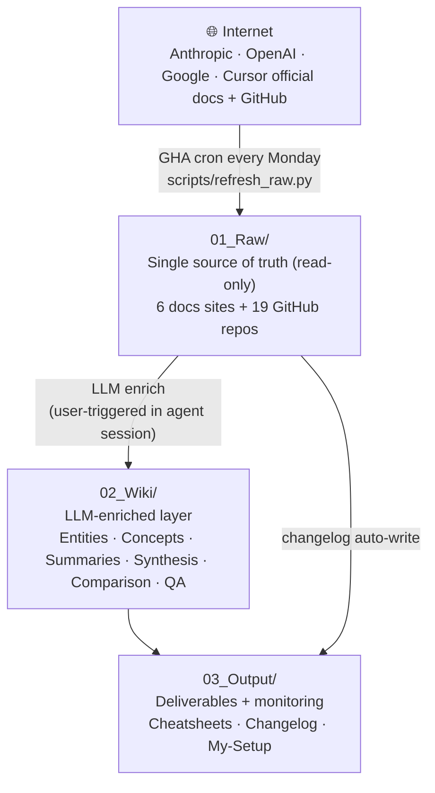

# AI Coding Runbook

[](./LICENSE)
[](https://github.com/NickCollect/ai-coding-runbook/commits/main)
[](https://github.com/NickCollect/ai-coding-runbook)
[](https://github.com/NickCollect/ai-coding-runbook/actions/workflows/refresh-raw.yml)
[](https://github.com/NickCollect/ai-coding-runbook/stargazers)

**English** | [中文](./README.md)

> **If you use Claude Code, Cursor, Codex CLI, Gemini and MCP, and you're tired of jumping across scattered official docs**, this repo gives you a **local, searchable, agent-readable multi-vendor AI coding knowledge base**. Weekly auto-sync of five vendors' official docs + LLM enrichment into a queryable wiki — clone it and your AI agent has long-term context out of the box.

---

## Why this exists

If you ——

- heavily use Claude Code / Cursor / Codex CLI but spend hours every week chasing each vendor's release notes / new features
- want cross-vendor comparisons ("Should I use Skills or MCP server? Are Cursor Rules the same as Claude's CLAUDE.md?") but each official site only covers itself
- want to give your AI agent **multi-vendor** long-term context, but no off-the-shelf open-source option exists
- find docs change so fast that model weights go stale, and your agent keeps answering with old info

then this repo auto-pulls all five vendors' official docs **weekly** + LLM-enriches them into **queryable entities / cheatsheets / decision matrices**. Clone it, open in your agent, and you have a long-term context store ready to go.

---

## Is this for you?

✅ **Yes if you're**:

- A heavy AI coding tool user (Claude Code / Cursor / Codex / Aider — any combination)
- A developer tracking docs changes across Claude / OpenAI / Gemini / Cursor
- Looking for multi-vendor long-term context for your AI agent
- A team wanting to internalize "which tool fits which job" without manually scraping docs
- An AI content creator / consultant who needs to cross-reference vendor docs

❌ **No if you want**:

- Latest model benchmarks (use lmarena / Artificial Analysis instead)
- Code samples to run (use official cookbooks / quickstart repos)
- Sub-week-fresh doc changes (this repo cron's weekly)

---

## vs Alternatives

| | Official docs | awesome-* lists | Context7 / commercial services | **This repo** |
|---|:---:|:---:|:---:|:---:|
| Multi-vendor | ❌ | ✅ | ✅ | ✅ |
| LLM-enriched (not just mirror) | ❌ | ❌ | ✅ | ✅ |
| Auto weekly refresh | ❌ | ❌ | ✅ | ✅ |
| Decision matrices / cheatsheets | ❌ | ❌ | partial | ✅ |
| Open source | ✅ | ✅ | ❌ | ✅ |
| Self-hosted (no third-party service) | N/A | ✅ | ❌ | ✅ |
| Zero API key (no paid subscription) | ✅ (read site) | ✅ | ❌ | ✅ |
| Long-term context for AI agents | ❌ | ❌ | via API | ✅ (CLAUDE.md / AGENTS.md hook) |

---

## 30-second Quickstart

```bash
git clone https://github.com/NickCollect/ai-coding-runbook
cursor ai-coding-runbook    # or claude (Claude Code), codex (Codex CLI)
```

Then ask your agent:

> "What's the difference between Skills, MCP servers, and Subagents — and when should I use each?"

The agent auto-loads `CLAUDE.md` / `AGENTS.md` project rules and reads `02_Wiki/Comparison/skill-vs-plugin-vs-mcp-vs-subagent.md` to answer. **Zero config, zero API key** (the agent uses your own subscription).

---

## Example Q&A

> **Q**: I want to add a Claude Code PreToolUse hook that checks for injected `Co-authored-by` trailers before every `git push`. How do I write it?
>
> **A** *(agent reads `02_Wiki/Entities/Hooks.md` + `03_Output/Cheatsheets/hooks-recipes.md`)*:
>
> 1. In `.claude/settings.json`, configure a `PreToolUse` hook with matcher `Bash(git push:*)`
> 2. The hook command receives stdin (JSON: `{"tool_name":"Bash","tool_input":{"command":"git push ..."}}`) and runs your check
> 3. Exit code controls flow: 0 = allow / 2 = block and surface stderr to Claude
>
> Full JSON schema in `02_Wiki/Entities/Hooks.md`, 13 hook recipes in `03_Output/Cheatsheets/hooks-recipes.md`.

(Real agent answer would be longer with full code + edge cases — abbreviated for illustration.)

---

## Stats

- **9,400+** raw files (markdown + git-cloned source code), maintained by 9 GHA matrix sources
- **1,300+** LLM-enriched summaries / **85+** entities / **25+** concepts / **8** synthesis essays / **5** comparison matrices / **7** Q&A docs / **10** cheatsheets
- **GHA cron**: matrix-parallel, every Monday 09:00 HKT, target ~10 min wall clock
- **Active since**: 2026-05

---

## Status

> **v0.1.0 — early preview**. Honest current state, not aspirational:

| Component | Status |
|---|---|
| Raw content (`01_Raw/`) | ✓ Manually seeded + GHA-bot maintained |
| Wiki enrichment (`02_Wiki/`) | ✓ Stable; growth is user-triggered, not automatic |
| Cheatsheets / comparisons (`03_Output/`) | ✓ Hand-maintained |
| GHA `refresh-raw` workflow | ⏳ Implemented; v0.1.0 just fixed a workflow.yml ↔ sources.yaml mismatch — first verified end-to-end run is the next milestone |
| OpenAI Platform docs auto-refresh | ✗ Cloudflare 403; manually fetched key pages only (`01_Raw/docs.openai.com/`, 30 guides) |
| Auto-enrichment from raw diffs | ✗ Intentionally **not** automated — anti-hallucination. User triggers in their own agent session |
| New-source onboarding | Manual (edit `scripts/sources.yaml`, validate with `--dry-run`, push) |

Each ✓ / ⏳ / ✗ above is explained in detail in [§ 3 Core Mechanisms](#3-core-mechanisms) and [§ 10 Limitations](#10-limitations).

---

## 1. Three-Layer Architecture



Detailed structure:

```
ai-coding-runbook/
├── 01_Raw/                    ← Source of truth (read-only, GHA bot writes)
│   ├── code.claude.com/       Claude Code docs
│   ├── platform.claude.com/   Anthropic API + platform docs
│   ├── anthropic.com/{research,engineering}/   blog
│   ├── docs.cursor.com/       Cursor IDE docs (selected prefixes)
│   ├── ai.google.dev/         Gemini API docs
│   ├── openai.com/            OpenAI blog
│   ├── docs.openai.com/       OpenAI platform docs (30 manually fetched pages, GHA cannot refresh)
│   ├── github/anthropics/<repo>/         (shallow clone)
│   ├── github/modelcontextprotocol/<repo>/
│   ├── github/openai/<repo>/
│   └── _meta/refresh_*.json   per-source last-crawl timestamps
│
├── 02_Wiki/                   ← LLM-enriched layer
│   ├── Entities/              Specific feature/tool dossiers (Skills, Hooks, MCP-server, ...)
│   ├── Concepts/              Abstract concepts (context-window, agentic-loop, prompt-caching, ...)
│   ├── Summaries/             1:1 summary per raw doc
│   ├── Synthesis/             Multi-entity essays
│   ├── Comparison/            Decision matrices
│   ├── QA/                    Q&A archive
│   ├── _canonical-names.md    Typo / multi-name corrigenda
│   └── _progress.log          Ingest operation log
│
├── 03_Output/                 ← Deliverables + monitoring
│   ├── Cheatsheets/           Daily lookups (hand-maintained)
│   ├── Changelog/             GHA auto-writes after each refresh
│   └── My-Setup/              Maintainer's personal plugin/skill setup notes
│
├── scripts/                   ← Automation
│   ├── sources.yaml           Source list
│   ├── refresh_raw.py         Crawler
│   ├── check_pending.py       Find raws without summary
│   └── audit.py               Structural audit
│
├── .github/workflows/refresh-raw.yml   GHA cron
├── CLAUDE.md                  agent session startup hook
├── AGENTS.md → CLAUDE.md      symlink (for Cursor / Codex / etc.)
├── system_instructions.md     Deep contract
└── README.md / README.en.md   This file
```

---

## 2. Three Ways to Use It

> Sorted by config cost, low to high.

### Mode 1: Reference / browsing (zero config)

```bash
git clone https://github.com/NickCollect/ai-coding-runbook
cd ai-coding-runbook
```

Open with Obsidian / VSCode / any markdown editor:

- **Cheatsheets** → `03_Output/Cheatsheets/*.md` (hook recipes, API quick refs, model pricing, etc.)
- **Cross-vendor decisions** → `02_Wiki/Comparison/*.md`
- **Specific feature** → `02_Wiki/Entities/<feature>.md`
- **Weekly changes** → `03_Output/Changelog/<latest>.md`

`.obsidianignore` already excludes large dirs so Obsidian stays snappy.

### Mode 2: Long-term context for an AI agent (recommended, zero config)

After clone, open the folder in **Claude Code / Cursor / Codex CLI**:

- Session startup auto-loads `CLAUDE.md` / `AGENTS.md`; the agent learns project structure and rules
- Ask any question — agent reads `02_Wiki/` to answer. See [Example Q&A](#example-qa) above

No extra API key needed — the agent uses your own subscription / token.

### Mode 3: Fork to follow your own sources

Fork if you want to:

- Add internal company / team doc sources, or remove sources you don't need
- Run your own GHA cron (auto-refresh every Monday)
- Customize the enrichment workflow

→ Fork to your GitHub account. The GHA workflow uses default `GITHUB_TOKEN` permissions; no extra secrets needed. Edit `scripts/sources.yaml` to change sources; next cron picks it up.

```bash
# Local manual refresh (for debugging)
pip install -r scripts/requirements.txt
python3 scripts/refresh_raw.py --all      # ~10 min
```

---

## 3. Core Mechanisms

### Mechanism 1 · GHA cron auto-pulls raw (matrix-parallel)

`.github/workflows/refresh-raw.yml` runs every Monday 01:00 UTC (= 09:00 HKT). **9 sources run in parallel** (GHA matrix), each with independent commit + push (`git pull --rebase` + 5 retries to handle concurrency).

```
matrix sources (parallel):
  - code.claude.com              # Claude Code docs
  - platform.claude.com          # Anthropic API + platform docs
  - anthropic.com                # research + engineering blog
  - docs.cursor.com              # Cursor IDE docs
  - ai.google.dev                # Gemini API docs
  - openai.com                   # OpenAI blog (model releases / announcements)
  - github.anthropics            # 8 repos (claude-code, agent-sdk, etc.)
  - github.modelcontextprotocol  # 6 repos (spec, sdks, servers, etc.)
  - github.openai                # 4 repos (codex, model_spec, etc.)
```

> **Important**: matrix source names must match `python3 scripts/refresh_raw.py --list` output **exactly**, or that matrix job fails with "unknown source". `fail-fast: false` ensures one failure doesn't kill the others.

Within each source: `ThreadPoolExecutor(5)` concurrent HTTP fetch + auto-retry (429/5xx backoff). Wall time ≈ max(any single source) ≈ **~10 min**.

**`platform.openai.com/docs` is not in the matrix**: Cloudflare 403-blocks crawlers. 30 manually fetched key pages live in `01_Raw/docs.openai.com/`.

**Aggregator job** (runs after matrix completes): scans last-2h bot commits → writes `03_Output/Changelog/YYYY-MM-DD.md`.

**`fail-fast: false`** — if one source fails, others continue; their commits are already pushed, so progress isn't lost.

**Manual trigger**: GitHub repo Actions tab → "Run workflow", or local `gh workflow run refresh-raw`.

**Local refresh** (for debugging):
```bash
python3 scripts/refresh_raw.py --list                       # list all source names
python3 scripts/refresh_raw.py --source code.claude.com     # one source
python3 scripts/refresh_raw.py --source github.anthropics
python3 scripts/refresh_raw.py --all                        # all sequential
python3 scripts/refresh_raw.py --source X --dry-run
```

GitHub repos are fetched with **`.git/` stripped** (so the parent repo doesn't treat them as submodules). Trade-off: lose original git history; benefit: files inside are tracked normally by the wiki repo. Full re-clone every week (small, ~3 min).

### Mechanism 2 · Enrichment flywheel ("cooked dishes" persist independently)

The entities / concepts / summaries in `02_Wiki/` are LLM-distilled from raw and **written into these files** — they exist independently of the LLM.

**Why this matters**: when answering questions, the LLM **doesn't need to re-read raw every time** — it reads the enriched entity directly. This is the root cause of fast queries + high accuracy.

**Why no auto-enrich**: when raw diffs are detected, GHA does **not** call an LLM to write summaries. It only generates a changelog notification. Reasons:

1. LLM enrichment hallucinates easily; needs self-review
2. What new entities / concepts to add is a design decision, not a pipeline
3. The user, in their own agent session (Claude Code / Cursor / Codex / etc.), reviews the changelog and decides which diffs are worth enriching

### Mechanism 3 · Template-driven living files (future)

Future: periodic prep / report-style auto-generated templates. `03_Output/templates` is currently empty — will be added once cheatsheets reach critical mass.

### Mechanism 4 · Structural audit

`scripts/audit.py` checks `02_Wiki/` internal consistency:

- Summary frontmatter `source:` resolves to a real raw
- Entity / concept has frontmatter + at least one section
- Wikilinks `[[X]]` resolve to real files
- No duplicate entity / concept names

Writes `02_Wiki/_audit_report--YYYYMMDD.md`.

### Mechanism 5 · Canonical names governance

`02_Wiki/_canonical-names.md` is the **single source of truth** — it records all mappings from raw-doc names to canonical vault names.

Examples:

- `Sub-agent` / `Subagent` / `Sub agent` → canonical: `Subagent`
- `Tool use` / `Function calling` → canonical: `Tool use`
- `Slash commands` / `Slash Commands` / `slash-commands` → canonical: `Slash commands`

**Required LLM rules**:
1. Before enriching: `cat 02_Wiki/_canonical-names.md`
2. Before referencing an unknown name: grep `02_Wiki/Entities/*.md` frontmatter `aliases`
3. Don't invent entity names from memory

---

## 4. Daily Workflow

### What the user does (no LLM)

| Scenario | Action |
|---|---|
| What did Anthropic change this week? | Open `03_Output/Changelog/<latest>.md` |
| Quick lookup | `03_Output/Cheatsheets/<topic>.md` |
| Pull remote updates (after GHA cron) | `cd <repo> && git pull` |
| Add a source | Edit `scripts/sources.yaml`, commit, push, next cron picks up |

### What the user asks the LLM to do

| Scenario | User says | LLM does |
|---|---|---|
| New raw to ingest | **Don't have to ask** — session startup auto-shows "📋 pending ingest". Say "ingest" / "ingest 1,3" / "skip" | Phase A→E (see end of this section) |
| Any Claude Code / API question | Ask directly | Reads enriched entity to answer; falls back to raw if missing |
| Write new cheatsheet | "Write a hooks cheatsheet" / "Make a Skill vs MCP comparison table" | Synthesizes across entities → writes to `03_Output/Cheatsheets/` |
| Add a source | "Add modelcontextprotocol/inspector repo" | Edits sources.yaml + commits + runs one refresh test |
| Run audit | "Run audit" | `python3 scripts/audit.py` |
| Fix typo | "Anthropic doc spells X as Y, but vault should use Y" | Updates canonical-names + bulk replace + re-run audit |

### LLM Phase A→E (ingest workflow)

After user authorizes:

| Phase | What | Self-review |
|---|---|---|
| **A · Summary creation** | Write summary for each pending raw to `02_Wiki/Summaries/` | Frontmatter compliant, source field points to real raw, no naming collisions |
| **B · Update existing entity / concept** | Append to `## 出现来源`; new facts to `## 关键属性` | **Don't create new files**; wikilinks resolve; facts have raw support |
| **C · Handle new names** | List candidates for user; user chooses → create stub | Only after user authorizes |
| **D · Audit** | `python3 scripts/audit.py` | List fixes, don't auto-apply |
| **E · Log** | Append `02_Wiki/_progress.log` | — |

Self-review per phase **prevents hallucination contamination across phases**.

---

## 5. 🚨 Lessons Learned

### #1 · Never modify 01_Raw

Raw is GHA bot output. Manual edits will:

- Get reverted on next cron (tug of war)
- Pollute git diff signal
- Mislead enrichment (false impression Anthropic changed something)

To "correct" content (e.g., Anthropic typos, outdated references) → use `02_Wiki/_canonical-names.md`.

### #2 · Raw beats model weights when in conflict

Anthropic changes APIs / adds features frequently. Anything after the Claude model's training cutoff exists only in raw. When answering, if raw has it, raw wins; if raw doesn't, model knowledge can be used (but explicitly tagged "based on training, not verified against latest docs").

### #3 · "I remember Claude Code has this feature" is not evidence

Every entity / concept fact must trace back to a raw file. Before writing `Hooks support X`, grep `01_Raw/` for the original. Can't find it? Write `(unverified)` or omit.

### #4 · Same concept, multiple names

Anthropic docs aren't even self-consistent: `Sub-agent` / `Subagent` / `subagent`, `Tool use` / `Function calling`, `Slash commands` / `slash-commands`. Unify via `_canonical-names.md`. Vault uses canonical; aliases live in entity frontmatter.

### #5 · ls before wikilinking

Before writing `[[Hooks]]`: `ls 02_Wiki/Entities/Hooks.md`. Don't write what doesn't exist — it becomes a dead link. Audit catches them, but writing should avoid them.

### #6 · Don't trust subagent findings directly

After dispatching a subagent for research, the master must sample re-verify (≥3 + all MAJOR claims). Subagents hallucinate, especially in unenriched domains.

### #7 · GHA pushes to main without PR review — sources.yaml is dangerous

GHA workflow has no PR review. A bad prefix in sources.yaml will make next cron pull 0 / wrong files. Before changing it, validate locally: `python3 scripts/refresh_raw.py --dry-run --only <kind>`.

### #8 · Multi-machine sync

Sync via git, not iCloud. **Don't hardcode absolute paths** in scripts — use `~`, `$HOME`, or project-relative paths (`Path(__file__).resolve().parent.parent`) so it runs on any machine.

---

## 6. Source list

See `scripts/sources.yaml`. Currently 9 active GHA matrix sources:

**Docs sites (6, sitemap → HTML→markdown)**

1. `code.claude.com` — Claude Code docs
2. `platform.claude.com` — Anthropic API + platform docs (legacy `docs.claude.com` 301-redirects to these two)
3. `anthropic.com/{research,engineering}` — Anthropic blog
4. `docs.cursor.com` — Cursor IDE docs (by prefix: `/get-started/` `/chat/` `/tab/` `/agent/` `/context/` `/settings/` `/troubleshooting/` `/account/` `/privacy/`)
5. `ai.google.dev/gemini-api/docs/` — Gemini API docs
6. `openai.com/{index,blog}/` — OpenAI blog (model releases / product announcements)

**GitHub repos (19 active, shallow git clone)**

7. `anthropics/*` — claude-code, claude-agent-sdk-python, anthropic-sdk-{python,typescript}, claude-code-action, claude-code-base-action, claude-quickstarts, prompt-eng-interactive-tutorial, skills
8. `modelcontextprotocol/*` — modelcontextprotocol (spec), python-sdk, typescript-sdk, servers, docs, mcpb (formerly anthropics/dxt)
9. `openai/*` — codex, openai-python, openai-node, model_spec

**Manually maintained (GHA does not refresh)**

- `docs.openai.com/` — `platform.openai.com/docs` is Cloudflare 403-blocked; 30 key guides fetched manually, re-fetch on demand

To add / remove a source: edit `scripts/sources.yaml`, commit. Next cron picks it up. **Always dry-run validate first**: `python3 scripts/refresh_raw.py --dry-run --source <name>`.

---

## 7. Maintenance

### Long-term (you do)
- Every Monday after GHA: `git pull`
- Read `03_Output/Changelog/<latest>.md`, decide whether to ingest
- Want to ingest → say "ingest" in your agent session (Claude Code / Cursor / Codex / etc.)

### Long-term (GHA does automatically)
- Pull raw every Monday 09:00 HKT
- Detect diff + commit + push
- Write changelog
- Email alert on failure

### To add / change a source
1. Edit `scripts/sources.yaml`
2. Validate locally: `python3 scripts/refresh_raw.py --dry-run --only <kind>`
3. Commit + push
4. Wait for next cron, or manually `gh workflow run refresh-raw`

### To change crawler behavior
1. Edit `scripts/refresh_raw.py`
2. Validate: `python3 scripts/refresh_raw.py --dry-run`
3. Commit + push
4. Next cron uses new version

---

## 8. Glossary

- **raw**: file in `01_Raw/`, fetched by GHA bot (markdown / git clone)
- **summary**: in `02_Wiki/Summaries/`, 1:1 summary per raw
- **entity**: in `02_Wiki/Entities/`, dossier on a specific feature / tool / model (aggregated across raws)
- **concept**: in `02_Wiki/Concepts/`, abstract concept
- **synthesis**: in `02_Wiki/Synthesis/`, multi-entity essay
- **comparison**: in `02_Wiki/Comparison/`, decision matrix / cross-vendor compare
- **cheatsheet**: in `03_Output/Cheatsheets/`, daily lookup
- **changelog**: in `03_Output/Changelog/`, GHA-written raw-change log
- **canonical name**: unified vault-internal name (vs raw-source variations)
- **stub**: placeholder entity / concept marked `<!-- stub: awaiting enrichment -->`

---

## 9. Related Docs

| File | Purpose |
|---|---|
| `CLAUDE.md` | agent session startup hook + key rules (Claude Code / Cursor / Codex / etc.) |
| `AGENTS.md` | symlink → CLAUDE.md, for Cursor / Codex / other agents |
| `system_instructions.md` | Deep contract §0-§7: frontmatter spec, ingest rules, edge cases |
| `scripts/sources.yaml` | Source list (YAML) |
| `02_Wiki/_canonical-names.md` | Typo / multi-name corrigenda (must read before enrich) |
| `docs/specs/` | Design docs for past upgrades |

---

## 10. Limitations

- **Not real-time** — weekly refresh; for sub-24h changes use vendor official changelogs / Twitter
- **Doesn't call LLM APIs** — this repo doesn't pay for LLM. All enrichment / Q&A uses your own agent (Claude Code / Cursor / Codex use their own subscriptions)
- **Some sites uncrawlable** — `platform.openai.com/docs` is Cloudflare-blocked. OpenAI is covered via GitHub repos (`openai-python`, `openai-node`, `model_spec`) + 30 manually fetched key pages
- **02_Wiki is LLM-written** — may contain errors. Audit + canonical-names mitigate but don't eliminate. Every fact links to source raws via `[[summary-link]]` for verification
- **No auto-enrich** — when raw diffs detected, only changelog is generated; no auto LLM calls. Enrichment is always user-triggered
- **Coverage scope**: currently covers 5 mainstream vendors + MCP. Others (Aider, Continue, Tabby, Chinese-market models) not yet included

---

## 11. License

This repo's **code, project structure, and `02_Wiki/` enriched content** are licensed under [MIT License](./LICENSE).

**`01_Raw/` is a third-party content cache** sourced from Anthropic / OpenAI / Google / Cursor official docs and GitHub repos. Copyright belongs to original authors. This project mirrors them locally + produces derivative summaries / analysis; no copyright is claimed over raw content. To cite specific raw content, follow the `source_url` field in summaries back to the original.

---

> **Meta-rule**: this file is the master comprehensive manual. `CLAUDE.md` / `AGENTS.md` / `system_instructions.md` are subsets / references. **In case of conflict, README.md wins.**
