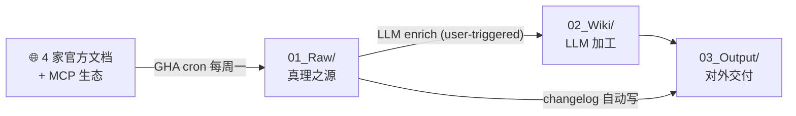

# AI Coding Runbook

[](./LICENSE)
[](https://github.com/NickCollect/ai-coding-runbook/commits/main)
[](https://github.com/NickCollect/ai-coding-runbook)
[](https://github.com/NickCollect/ai-coding-runbook/actions/workflows/refresh-raw.yml)
[](https://github.com/NickCollect/ai-coding-runbook/stargazers)

[English](./README.en.md) | **中文**

> **如果你同时用 Claude Code / Cursor / Codex CLI / Gemini / MCP，且烦透了在多家官方文档之间反复跳**，这个 repo 给你一个**本地、可搜索、给 AI agent 读的多厂商 AI 编程知识库**。每周自动抓 4 家官方文档 + MCP 协议生态 + LLM 加工成可查询 wiki，clone 完直接给 agent 当 long-term context。

---

## 这个项目解决什么问题

如果你 ——

- 重度用 Claude Code / Cursor / Codex CLI，但每周都要追各家 release notes / 新 feature
- 想跨厂商对比（"我该用 Skills 还是 MCP server？Cursor 的 Rules 跟 Claude 的 CLAUDE.md 一样吗？"），但官方站只讲自家
- 想给你的 AI agent 喂 long-term **多厂商**上下文，但市面没现成的开源选项
- 文档变化快，模型权重过期，agent 答的不一定是最新版

那这个 repo 把这 4 家官方文档（Anthropic / OpenAI / Google / Cursor）+ MCP 协议生态**每周自动抓** + LLM **加工成可查询的 entity / cheatsheet / decision matrix**，clone 完就能直接给 agent 当 long-term context。

---

## 适合谁用

✅ **适合**：

- AI coding tool 重度用户（Claude Code / Cursor / Codex CLI / Aider 等任意一种或多种）
- 想跟踪 Claude / OpenAI / Gemini / Cursor 各家文档变化的开发者
- 想给自己的 AI agent 喂多厂商 long-term context 的人
- 团队想沉淀 "什么场景该用什么工具" 的内部知识，但不想自己抓文档
- AI 内容创作者 / 顾问，常需要查多家文档对比

❌ **不适合**：

- 找最新模型 benchmark 数字（去 lmarena / Artificial Analysis 等专业 site）
- 找代码示例运行（去 official cookbook / quickstart repos）
- 需要实时（< 1 周）文档变化（当前 cron 周更新）

---

## 和同类方案的区别

| | 各家 official docs | awesome-* 链接列表 | Context7 / 类似商业 service | **本仓库** |
|---|:---:|:---:|:---:|:---:|
| 多厂商聚合 | ❌ | ✅ | ✅ | ✅ |
| LLM-enriched（不止 mirror） | ❌ | ❌ | ✅ | ✅ |
| 自动周更新 | ❌ | ❌ | ✅ | ✅ |
| Decision matrix / cheatsheet | ❌ | ❌ | 部分 | ✅ |
| Open source | ✅ | ✅ | ❌ | ✅ |
| Self-hosted（不依赖第三方 service） | N/A | ✅ | ❌ | ✅ |
| 0 API key（不用付费） | ✅（看官网） | ✅ | ❌ | ✅ |
| 给 AI agent 当 long-term context | ❌ | ❌ | 通过 API | ✅（CLAUDE.md / AGENTS.md hook） |

---

## 30 秒上手

```bash
git clone https://github.com/NickCollect/ai-coding-runbook
cd ai-coding-runbook
```

然后用任意 AI 编程 agent 打开这个文件夹（**Claude Code / Cursor / Codex CLI / Gemini CLI / Aider** 等）。session 启动会自动加载 `CLAUDE.md` / `AGENTS.md`，agent 知道项目结构和工作规则。

直接问 agent：

> "Skills、MCP server 和 Subagent 三个概念有啥区别？什么时候用哪个？"

agent 读 `02_Wiki/Comparison/skill-vs-plugin-vs-mcp-vs-subagent.md` 答你。**0 配置、0 API key**（agent 用你自己的订阅）。

---

## Example Q&A

> **Q**：我想给 Claude Code 加一个 PreToolUse hook，每次跑 `git push` 之前自动检查有没有 Co-authored-by 这种被注入的 trailer。怎么写？
>
> **A**（agent 读 `02_Wiki/Entities/Hooks.md` + `03_Output/Cheatsheets/hooks-recipes.md` 答）：
>
> 1. 在 `.claude/settings.json` 里配 `PreToolUse` hook，matcher 用 `Bash(git push:*)`
> 2. hook command 接 stdin（JSON: `{"tool_name":"Bash","tool_input":{"command":"git push ..."}}`），跑前置检查
> 3. 退出码控制：0 = 通过 / 2 = block 并把 stderr 显给 Claude
>
> 完整 JSON schema 在 `02_Wiki/Entities/Hooks.md`，13 个 hook recipe 在 `03_Output/Cheatsheets/hooks-recipes.md`。

实际 agent 答会更长，包含完整代码 + 各 edge case。这只是缩短示意。

---

## 实际 wiki 长啥样（sample）

Wiki 不只是 mirror 官方文档 —— 真正有价值的是 **`02_Wiki/Comparison/`** 下的横向对比和 **`03_Output/Cheatsheets/`** 下的速查。例：

> **从 [`03_Output/Cheatsheets/skill-vs-plugin-vs-mcp-vs-subagent.md`](./03_Output/Cheatsheets/skill-vs-plugin-vs-mcp-vs-subagent.md)：**
>
> Claude Code 4 种最常被混淆的扩展机制 —— 一句话区分：
>
> - **Skill** = 一份可加载的"专项知识 + 流程"（文件，本地）
> - **Plugin** = 多种东西的**打包分发**容器（可含 skills/hooks/MCP/subagents/commands）
> - **MCP-server** = 把**外部服务**接进来当 tool（进程，远程或本地）
> - **Subagent** = **隔离 context** 的子 agent（运行时，不是文件）
>
> | 你想 ... | 用 | 原因 |
> |---|---|---|
> | 把"PDF 处理"这样一个**专项流程**变成 Claude 自动调用的能力 | **Skill** | model-invoked、文件少、本地路径就能跑 |
> | 把"GitHub PR 工具集 + 配套 hook + 脚本"作为**一个包分发**给团队 | **Plugin** | 唯一支持 marketplace + 版本化分发的容器 |
> | 让 Claude 能查公司内部 **数据库 / 私有 API** | **MCP-server** | MCP 是接外部服务的标准协议 |
> | 让 Claude **大批量做某类任务**，又不想污染主 context | **Subagent** | 隔离 context，最终只回主一条总结 |
> | 在 commit 前**强制 lint**、把 prompt **强制改写**、调用前**审核 tool 参数** | **Hook** | 唯一在生命周期固定点 deterministic 触发的机制 |
>
> *(还有 5 维属性对比 + 5 个组合 pattern + 易踩的坑 + wikilink 回到 5 份 entity 详档，详见原文)*

类似的还有：

- [`agent-sdk-quick-reference.md`](./03_Output/Cheatsheets/agent-sdk-quick-reference.md) —— Claude Agent SDK 关键 API 速查
- [`hooks-recipes.md`](./03_Output/Cheatsheets/hooks-recipes.md) —— 13 个常用 hook recipe
- [`model-pricing.md`](./03_Output/Cheatsheets/model-pricing.md) —— Anthropic / OpenAI / Google / Cursor 模型横向 pricing 对比
- [`plugin-install-and-marketplace.md`](./03_Output/Cheatsheets/plugin-install-and-marketplace.md) —— Plugin 安装 + marketplace 全流程

完整列表 → [`03_Output/Cheatsheets/`](./03_Output/Cheatsheets/) · 跨厂商决策矩阵 → [`02_Wiki/Comparison/`](./02_Wiki/Comparison/)

---

## Stats

- **9,500+** raw 文件（markdown + git-clone 来的源代码），9 个 GHA matrix source 维护
- **1,300+** LLM-enriched summaries / **85+** entity / **25+** concept / **8** synthesis / **5** comparison / **7** Q&A / **10** cheatsheet
- **GHA cron**：matrix 并行，每周一 09:00 HKT。最近一次 verified run **2026-05-05，9/9 success，wall time 12m42s**
- **Active since**：2026-05

---

## Status

> **v0.1.0 — early preview**。下面是诚实的当前状态，不是宣传：

| 组件 | 状态 |
|---|---|
| Raw 内容（`01_Raw/`） | ✓ 手动 seed + GHA bot 维护 |
| Wiki enrichment（`02_Wiki/`） | ✓ 稳定；增长靠 user-triggered，不自动 |
| Cheatsheets / comparisons（`03_Output/`） | ✓ 手维护 |
| GHA `refresh-raw` workflow | ✓ 首次端到端 verified run **2026-05-05**（9/9 jobs success，wall time 12m42s，自动写了 `03_Output/Changelog/2026-05-05.md`）。Cron 每周一 09:00 HKT 自动跑 |
| OpenAI Platform docs 自动刷新 | ✗ Cloudflare 403 防爬；只能手动抓关键页面（`01_Raw/docs.openai.com/`，30 个 guides） |
| 从 raw diff 自动 enrich | ✗ **故意**不自动 —— 防 LLM 幻觉。用户在自己的 agent session 里触发 |
| 新 source 接入 | 手动（编辑 `scripts/sources.yaml`，`--dry-run` 验证，push） |

每个 ✓ / ✗ 在 [Limitations](#limitations--已知限制) 和 [`docs/ARCHITECTURE.md`](./docs/ARCHITECTURE.md) 有详细解释。

---

## 三层架构（速记）



```
01_Raw/        ← 6 个 docs site + 19 个 GitHub repo（read-only，GHA bot 写）
02_Wiki/       ← Entities / Concepts / Summaries / Synthesis / Comparison / QA
03_Output/     ← Cheatsheets / Changelog / My-Setup
```

完整目录树 + 5 个核心机制（GHA cron 并行、enrichment 飞轮、audit、canonical-names）→ [`docs/ARCHITECTURE.md`](./docs/ARCHITECTURE.md)

---

## 三种用法

> 按"配置成本"从低到高排。

### 用法 1：当查阅文档（0 配置）

```bash
git clone https://github.com/NickCollect/ai-coding-runbook
cd ai-coding-runbook
```

然后用 Obsidian / VSCode / 任何 markdown 编辑器打开：

- **看速查表** → `03_Output/Cheatsheets/*.md`（hook recipes、API 速查、模型定价等）
- **看横向对比** → `02_Wiki/Comparison/*.md`（Claude / Cursor / Codex 决策表等）
- **查具体 feature** → `02_Wiki/Entities/<feature>.md`
- **看每周变化** → `03_Output/Changelog/<latest>.md`

`.obsidianignore` 已经排除大目录，Obsidian 打开不卡。

### 用法 2：给 AI agent 当 long-term context（最推荐，0 配置）

clone 后用 **Claude Code / Cursor / Codex CLI / Gemini CLI / Aider** 打开这个文件夹：

- session 启动自动加载 `CLAUDE.md` / `AGENTS.md`，agent 知道项目结构和工作规则
- 直接问问题，agent 读 `02_Wiki/` 答。例子见上面 [Example Q&A](#example-qa)

不需要额外 API key —— agent 用你自己的订阅 / token。

### 用法 3：fork 后跟自己的源（要 fork）

如果要：

- 加公司内部 / 团队文档源、删不需要的源
- 跑自己的 GHA cron（每周一自动刷 raw）
- 改 enrichment 流程

→ fork 这个 repo 到你的 GitHub 账号。GHA workflow 用默认 `GITHUB_TOKEN` 权限够用，不需要额外 secret。改源清单：编辑 `scripts/sources.yaml`，下次 cron 自动覆盖。

```bash
# 本地手动刷新一次（调试用）
pip install -r scripts/requirements.txt
python3 scripts/refresh_raw.py --all      # ~10 分钟
```

---

## 源清单

详见 `scripts/sources.yaml`。当前 9 个 GHA matrix source（Docs 6 + GitHub 3 group / 19 repo），加 `docs.openai.com/` 30 个手动抓的关键 guide。

完整源列表 + 抓取细节 → [`docs/ARCHITECTURE.md`](./docs/ARCHITECTURE.md)（§ 二 机制 1）

加 / 减源：编辑 `scripts/sources.yaml`，commit。下次 cron 跑自动覆盖。**改前必须 dry-run 验证**：`python3 scripts/refresh_raw.py --dry-run --source <name>`。

---

## Limitations / 已知限制

- **不实时** —— 周更新；要追 24h 内变化用各家 official changelog / Twitter
- **不调 LLM API** —— 这个 repo 不付费 LLM。所有 enrichment / 问答都用你自己的 agent（Claude Code / Cursor / Codex 用各自订阅）
- **某些站抓不到** —— `platform.openai.com/docs` 被 Cloudflare 403 防爬虫。OpenAI 部分靠 GitHub repos（`openai-python`, `openai-node`, `model_spec`）+ 手动 fetch 的 30 个关键页面覆盖
- **02_Wiki 是 LLM 写的** —— 可能有错；用 audit + canonical-names 治理但不绝对。每条事实都附 `[[summary-link]]` 可回查 raw 校对
- **不自动 enrich** —— 抓到 raw diff 后只生成 changelog 通知，不自动调 LLM 写 summary。Enrichment 永远 user-triggered
- **覆盖范围**：当前只覆盖 4 家主流 vendor + MCP 生态，其他工具（Aider / Continue / Tabby / 国产模型）没纳入

---

## 详细文档

| 文档 | 用途 |
|---|---|
| [`docs/ARCHITECTURE.md`](./docs/ARCHITECTURE.md) | 完整目录树 + 5 个核心机制（GHA cron / enrichment 飞轮 / audit / canonical-names） |
| [`docs/INGEST_WORKFLOW.md`](./docs/INGEST_WORKFLOW.md) | LLM ingest SOP（Phase A→E + 用户日常工作流） |
| [`docs/MAINTENANCE.md`](./docs/MAINTENANCE.md) | 维护者手册（踩过的坑 / 长期节奏 / 术语表） |
| [`CLAUDE.md`](./CLAUDE.md) | agent session 启动钩子 + 关键规则速查（Claude Code / Cursor / Codex 等） |
| [`AGENTS.md`](./AGENTS.md) | symlink → CLAUDE.md，给 Cursor / Codex 等其他 agent |
| [`system_instructions.md`](./system_instructions.md) | 深度契约 §0-§7：frontmatter 规范 / 入库规则 / ingest 流程 / edge case |
| [`scripts/sources.yaml`](./scripts/sources.yaml) | 源清单（YAML） |
| [`02_Wiki/_canonical-names.md`](./02_Wiki/_canonical-names.md) | 错别字 / 多名同实勘误（enrich 前必读） |

---

## License

本仓库的 **代码、项目结构、`02_Wiki/` 加工内容** 采用 [MIT License](./LICENSE)。

**`01_Raw/` 是第三方内容缓存**：来自 Anthropic / OpenAI / Google / Cursor 等官方文档和 GitHub repo，版权归各原作者所有。本项目仅做本地镜像 + 衍生摘要分析，不主张任何 raw 内容的版权。引用具体 raw 内容时请回到原文链接（summary 里的 `source_url` 字段）。

---

> **元规则**：本文件是项目 landing page，详细架构 / 维护 / ingest SOP 在 [`docs/`](./docs/) 下。冲突时以 README 为准。
