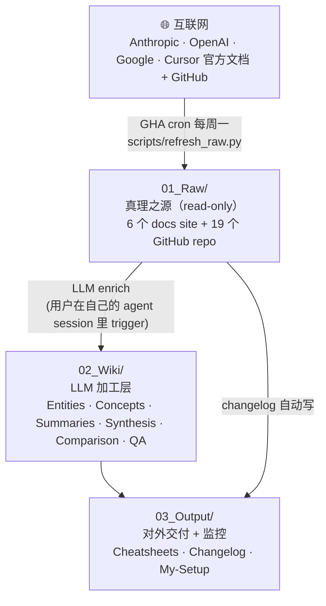

# Architecture

> 详细架构 + 核心机制。README 的 § 三层架构是浓缩版，这份是完整参考。

---

## 一、三层结构



详细目录结构：

```
ai-coding-runbook/
├── 01_Raw/                    ← 真理之源（read-only，GHA bot 写）
│   ├── code.claude.com/       Claude Code 文档
│   ├── platform.claude.com/   Anthropic API + 平台文档
│   ├── anthropic.com/{research,engineering}/   blog
│   ├── docs.cursor.com/       Cursor IDE 文档（按 prefix 抓主要 sections）
│   ├── ai.google.dev/         Gemini API 文档
│   ├── openai.com/            OpenAI 官网 blog
│   ├── docs.openai.com/       OpenAI 平台文档（手动抓的 30 个 key pages，GHA 不刷）
│   ├── github/anthropics/<repo>/        （shallow clone）
│   ├── github/modelcontextprotocol/<repo>/
│   ├── github/openai/<repo>/
│   └── _meta/refresh_*.json   各 source 上次抓的时间戳
│
├── 02_Wiki/                   ← LLM 加工层
│   ├── Entities/              具体 feature/tool 档案（Skills, Hooks, MCP-server, ...）
│   ├── Concepts/              抽象概念（context-window, agentic-loop, prompt-caching, ...）
│   ├── Summaries/             每份 raw 的 1:1 摘要
│   ├── Synthesis/             跨多 entity 的综述
│   ├── Comparison/            decision matrix
│   ├── QA/                    问答沉淀
│   ├── _canonical-names.md    错别字 / 多名同实勘误
│   └── _progress.log          历次 ingest 操作日志
│
├── 03_Output/                 ← 对外 + 监控
│   ├── Cheatsheets/           日常速查（手维护）
│   ├── Changelog/             GHA 每次 refresh 自动写
│   └── My-Setup/              维护者的 plugin/skill 配置笔记
│
├── scripts/                   ← 自动化
│   ├── sources.yaml           源清单
│   ├── refresh_raw.py         crawler
│   ├── check_pending.py       找未 summary 的 raw
│   └── audit.py               结构性 audit
│
├── .github/workflows/refresh-raw.yml   GHA cron
├── CLAUDE.md                  agent session 启动钩子
├── AGENTS.md → CLAUDE.md      symlink（给 Cursor / Codex 等）
├── system_instructions.md     深度契约
└── README.md / README.en.md   主要 landing page
```

---

## 二、核心机制

### 机制 1 · GHA cron 自动抓 raw（matrix 并行）

`.github/workflows/refresh-raw.yml` 每周一 01:00 UTC（= 09:00 HKT）自动跑。**9 个 source 并行**（GHA matrix），每个 source 独立 commit + push（`git pull --rebase` + 重试 5 次防并发冲突）。

```
matrix sources (parallel):
  - code.claude.com              # Claude Code 文档
  - platform.claude.com          # Anthropic API + 平台文档
  - anthropic.com                # research + engineering blog
  - docs.cursor.com              # Cursor IDE 文档
  - ai.google.dev                # Gemini API 文档
  - openai.com                   # OpenAI 官网 blog（model release）
  - github.anthropics            # 8 个 repo（claude-code, agent-sdk 等）
  - github.modelcontextprotocol  # 6 个 repo（spec, sdks, servers 等）
  - github.openai                # 4 个 repo（codex, model_spec 等）
```

> **注意**：matrix source 名字必须跟 `python3 scripts/refresh_raw.py --list` 输出**完全一致**，否则该 matrix job 会以 "unknown source" 失败。`fail-fast: false` 保证一个挂掉不影响其他。

每个 source 内：`ThreadPoolExecutor(5)` 并发 HTTP fetch + 自动 retry（429/5xx backoff）。Wall time ≈ max(单 source) ≈ **~10 分钟**。

**`platform.openai.com/docs` 不在 matrix 里**：被 Cloudflare 403 防爬；手动抓的 30 个关键页面在 `01_Raw/docs.openai.com/`。

**aggregator job**（matrix 全跑完后跑一次）：扫最近 2h 内 bot commits → 写 `03_Output/Changelog/YYYY-MM-DD.md`。

**`fail-fast: false`** —— 一个 source 挂了，其他继续，已抓的内容已 commit 不丢。

**人工触发**：GitHub repo Actions 页面点 "Run workflow"，或本地 `gh workflow run refresh-raw`。

**本地刷新**（调试）：

```bash
python3 scripts/refresh_raw.py --list                       # 列所有 source 名
python3 scripts/refresh_raw.py --source code.claude.com     # 单 source
python3 scripts/refresh_raw.py --source github.anthropics
python3 scripts/refresh_raw.py --all                        # 全部 sequential
python3 scripts/refresh_raw.py --source X --dry-run
```

GitHub repos 抓回来后会**剥离 `.git/`**（避免被父 repo 当成 submodule）。代价：失去原 repo 的 git history；好处：repo 内文件正常被 wiki repo 跟踪。每周完整 re-clone（小，3 分钟）。

### 机制 2 · Enrichment 飞轮（"煮过的菜"独立存在）

02_Wiki 里的 entity / concept / summary 是 LLM 从 raw 提炼后**写到这些文件里**的，**已经独立存在**。

**飞轮的核心意义**：LLM 答问题时**不需要每次重读 raw**——直接读 enriched entity 就够。这是查询速度快 + 准确度高的根本原因。

**为啥不自动 enrich**：抓到 raw diff 后，GHA **不自动调 LLM** 写 summary，只生成 changelog 通知。原因：

1. LLM enrich 容易幻觉，需要 self-review
2. 加什么 entity / concept 是设计决定，不是流水线
3. 用户在自己的 agent session（Claude Code / Cursor / Codex 等）里看到 changelog，决定哪些 diff 值得 enrich、哪些 skip

### 机制 3 · 模板驱动的活文件（将来）

将来：定期 prep / report 类的活模板生成。当前 `03_Output/templates` 是空的，等 cheatsheet 数量够多后再加自动模板。

### 机制 4 · 结构性 audit

`scripts/audit.py` 检查 `02_Wiki` 的内部一致性：

- Summary 是否有 frontmatter `source:` 指向真 raw
- Entity / Concept 是否有 frontmatter + 至少一个 section
- Wikilink `[[X]]` 是否指向真文件
- Entity / Concept 名字是否重复

跑完写 `02_Wiki/_audit_report--YYYYMMDD.md`。

### 机制 5 · canonical-names 错别字 / 多名同实治理

`02_Wiki/_canonical-names.md` 是**单一事实源** —— 记录所有 raw 里出现但 vault 用 canonical 名的映射。

例：

- `Sub-agent` / `Subagent` / `Sub agent` → canonical: `Subagent`
- `Tool use` / `Function calling` → canonical: `Tool use`
- `Slash commands` / `Slash Commands` / `slash-commands` → canonical: `Slash commands`

**LLM 必读规则**：

1. enrich 前 `cat 02_Wiki/_canonical-names.md`
2. 引用未知名字前在 `02_Wiki/Entities/*.md` 的 frontmatter `aliases` 里 grep 一遍
3. 不要凭脑补造 entity 名

---

## 相关文档

- [`../README.md`](../README.md) — 项目 landing page + 用户上手
- [`./INGEST_WORKFLOW.md`](./INGEST_WORKFLOW.md) — LLM ingest Phase A→E SOP
- [`./MAINTENANCE.md`](./MAINTENANCE.md) — 维护者手册（lessons learned + ops）
- [`../CLAUDE.md`](../CLAUDE.md) — agent session 启动钩子
- [`../system_instructions.md`](../system_instructions.md) — frontmatter 规范 + 深度契约
